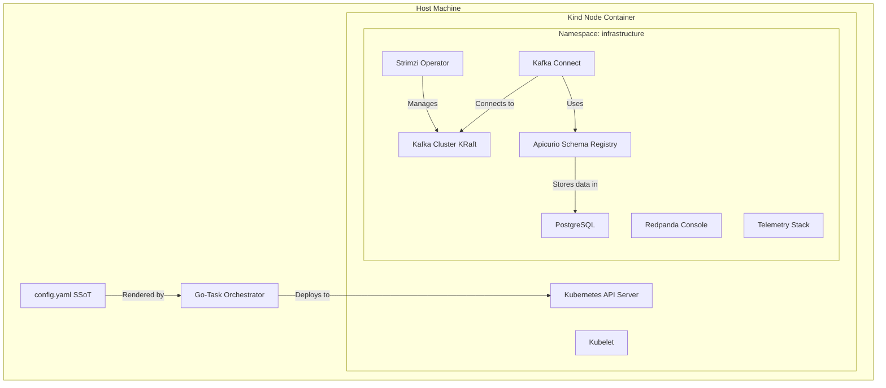

# Architecture Overview

Our local development cluster is built on a highly engineered, production-like foundation. It is not just a collection of Docker containers, but a fully functional single-node Kubernetes cluster.

## Cluster Topology

At its core, the environment utilizes **Kind (Kubernetes in Docker)**. This allows us to run a standard Kubernetes control plane and node using a Docker (or Podman/Colima) container.

## The Single Source of Truth (SSoT)

Every piece of the architecture begins with `config.yaml`. 
Unlike traditional setups where developers must edit multiple Helm values, Kubernetes manifests, and bash scripts to change a single port, our architecture relies on an intelligent rendering pipeline. 

When a lifecycle command is run (e.g., `task up`), the pipeline reads `config.yaml` and deterministically templates all required configuration files, which are then applied to the cluster natively via Kustomize.

Read more about this mechanism in the [SSoT Rendering Pipeline](../internals/ssot-pipeline.md) document.

## Key Architectural Pillars

For a deeper dive into specific architectural components, refer to the following guides:

-   **[CNCF & Open Source Philosophy](philosophy.md)**: Why we chose our specific toolchain and how it aligns with industry standards.
-   **[The Kafka Stack Architecture](kafka-stack.md)**: Deep dive into the Strimzi Operator, KRaft, and service interactions.
-   **[Telemetry & Observability Stack](telemetry-stack.md)**: How metrics and logs are captured using OTel and Prometheus.
-   **[Resource Management & Sizing](resource-management.md)**: Understanding how the cluster stays within its local resource footprint.
-   **[Road to Production](production-path.md)**: Guidelines for transitioning from this local environment to production-grade deployments.
