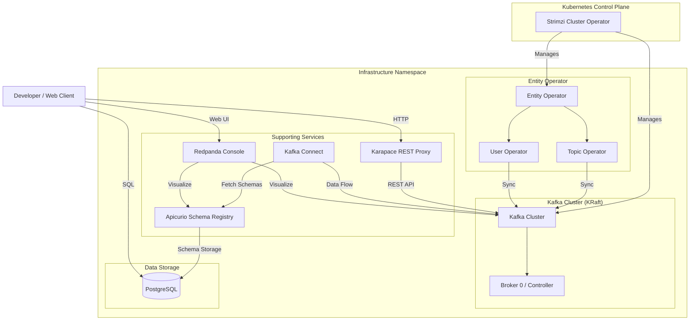

# The Kafka Stack Architecture

The local development cluster provides a complete event-streaming infrastructure, utilizing the Operator pattern combined with the latest KRaft architecture for a high-fidelity, modern Kafka experience.

## Cluster Architecture

The deployment follows a strictly decoupled architecture where the control plane (Operators) manages the lifecycle of the data plane (Kafka Brokers).

### The Operator Ecosystem
-   **Cluster Operator**: The primary engine. It watches for `Kafka` custom resources and manages the underlying StatefulSets and Services.
-   **Entity Operator**: Deployed alongside the cluster, it contains:
    -   **Topic Operator**: Provides a bidirectional synchronization between `KafkaTopic` resources and the Kafka brokers.
    -   **User Operator**: Handles authentication (TLS/SCRAM) and authorization (ACLs) by watching `KafkaUser` resources.

### Decoupled Node Roles (Architectural Parity)
While Strimzi supports a `DualRole` (combined Broker and Controller) for extreme resource efficiency on a single node, our environment explicitly maintains **distinct node roles** even in our local single-node setup.

> [!NOTE]
> **Why avoid DualRole?**
> By keeping the Broker and Controller logic separate in our manifests, we ensure that the local environment is structurally identical to a high-availability production cluster. This approach allows us to scale to a multi-node topology (e.g., 3 Brokers, 3 Controllers) simply by increasing the replica count in `config.yaml`, without requiring a fundamental change to the cluster's role definitions.

## Real-World Service Interactions

### 1. Karapace REST Proxy (The Gateway)
Karapace acts as a drop-in replacement for the Confluent REST Proxy, enabling HTTP-based interactions with Kafka.
-   **Producing Events**: Non-Java clients (Web, Python, Go) POST JSON data. Karapace automatically handles the conversion to binary format (Avro/Protobuf) by interacting with the Registry.
-   **Consuming Events**: Allows fetching messages from topics via standard RESTful calls, useful for frontend applications or serverless functions.

### 2. Apicurio Schema Registry (The Contract Store)
The Registry acts as the source of truth for all message contracts (Schemas).
-   **Decoupled Storage**: Unlike registries that store schemas in a Kafka `_schemas` topic, our Apicurio deployment uses **PostgreSQL**. This ensures that the registry can start and remain healthy even if the Kafka cluster is undergoing maintenance.
-   **Inter-Service Sync**: Karapace, Kafka Connect, and the Redpanda Console all communicate with the Registry via a standardized REST API to validate and visualize data.

### 3. Kafka Connect (The Data Pipeline)
Connect is the engine for streaming data in and out of the cluster.
-   **Change Data Capture (CDC)**: Often used with Debezium to stream database changes into Kafka topics.
-   **Contract Enforcement**: During the ingestion process, Connect workers pull schema definitions from the Registry to ensure that incoming data matches the expected organization-wide contracts.

## KRaft vs. ZooKeeper

The environment explicitly uses **KRaft (Kafka Raft Metadata mode)**, the modern standard that replaces Apache ZooKeeper for managing cluster metadata and leader elections.

### Why KRaft?
- **Footprint**: Eliminating ZooKeeper reduces memory and CPU consumption.
- **Performance**: Metadata is managed as an internal Kafka event log, accelerating startup and recovery.
- **Modernity**: KRaft is the future of Kafka; using it locally ensures alignment with modern production standards.

## The Schema Registry Landscape

Selecting a Schema Registry involves balancing compatibility, storage backends, and resource usage.

| Registry | Backend | License | RAM Footprint | Notes |
| :--- | :--- | :--- | :--- | :--- |
| **Confluent** | Kafka (`_schemas` topic) | Confluent Community | High (~500MB+) | The industry original; excellent documentation but heavy and vendor-locked. |
| **Karapace** | Kafka (`_schemas` topic) | Apache 2.0 | Medium (~256MB) | Python-based drop-in replacement by Aiven; lightweight but retains circular dependency on Kafka health. |
| **Apicurio** | **PostgreSQL** / Kafka | Apache 2.0 | Low-Medium (~300MB) | **Our Choice.** Supports multiple backends; SQL storage provides superior observability and decouples registry health from Kafka. |
| **AxonOps** | Proprietary | Commercial/Free Tier | Low | Observability-focused; offers great insights but often requires proprietary agents, moving away from a pure CNCF-aligned stack. |

### Why Apicurio with PostgreSQL?
Apicurio was selected because it provides a Confluent-compatible REST API while allowing the use of **PostgreSQL** for storage. This architectural choice decouples the registry from Kafka, allowing it to start independently and providing easier debugging through the included database UI.

## Ecosystem Integrations

### Kafka Connect
Included by default is a **Kafka Connect** distributed worker. This framework facilitates building streaming pipelines between Kafka and external systems. Deployed as a Kubernetes deployment, it exposes its REST API via NodePort for easy local connector development.

### Karapace REST Proxy
We include **Karapace** (maintained by Aiven), a drop-in replacement for the Confluent REST Proxy.
* **Why not Strimzi Kafka Bridge?** Karapace fully supports schema-aware event publishing (binary and JSON), a critical feature missing in the default Strimzi bridge, making it much more powerful for testing web clients against serialized data.

### Redpanda Console
The visual layer is powered by **Redpanda Console**. It's a modern web UI allowing you to browse topics, messages, consumer groups, and schemas. It natively understands our Apicurio registry endpoint and provides an extremely snappy, responsive experience compared to legacy tools.
