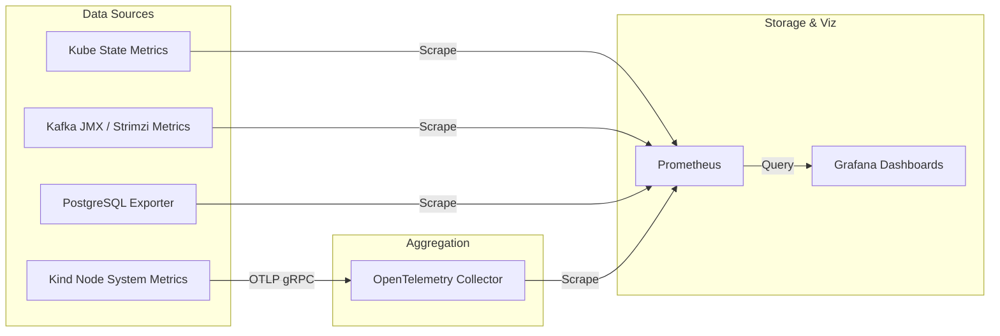

# Telemetry & Observability Stack

A production-grade environment requires deep visibility into its internals. Our local cluster ships with a unified telemetry stack designed to collect, aggregate, and visualize metrics from across the entire architecture.

## Stack Overview

## Component Architecture

### OpenTelemetry (OTel) Collector
We use the **OpenTelemetry Collector (Contrib version)** as the central ingestion point for advanced metrics. 
While Prometheus handles scraping directly for many components, OTel provides a future-proof layer for tracing and advanced log routing if required later. It receives data (e.g., via OTLP over gRPC on port 4317) and exposes aggregated metrics on port 8889 for Prometheus to scrape.

### Prometheus
The core time-series database. Prometheus is configured automatically by our `render:telemetry` task. 
It dynamically scrapes:
- Strimzi Kafka metrics via port 9404.
- Application metrics via standard `/metrics` endpoints.
- PostgreSQL sidecar exporter metrics.
- The OTel Collector's aggregated endpoint.

### Kube State Metrics (KSM)
To monitor the Kubernetes layer itself (Pod states, Deployment replicas, Resource limits vs requests), we deploy `kube-state-metrics`. This provides Prometheus with deep insight into the orchestration lifecycle.

### PostgreSQL Sidecar Exporter
Instead of running a separate deployment for Postgres metrics, we utilize a **sidecar pattern**. The `postgres-exporter` container runs inside the identical Pod as the main PostgreSQL database, communicating over `localhost`. It exposes metrics on port 9187, translating native Postgres stats into Prometheus format.

### Grafana & Automated Dashboards
Grafana provides the visualization layer. 
Our rendering pipeline natively automates the setup of Grafana by:
1. **Provisioning Datasources:** Automatically connecting Grafana to the local Prometheus instance.
2. **Dashboard Ingestion:** The `Taskfile` downloads curated expert dashboards directly from Grafana.com (IDs 10973, 9628, 13332).
3. **Dynamic Patching:** Since community dashboards often rely on specific labels (like `release=$release`), our `yq` pipeline patches the JSON on the fly to match our `infrastructure` namespace labels natively, ensuring dashboards work 100% out-of-the-box with zero manual configuration.

## Design Trade-offs: Why not SigNoz?
While unified APM platforms like SigNoz or Datadog are incredibly powerful, they require significant JVM/ClickHouse overhead. To adhere to our strict Resource Management Strategy (staying under ~8GB RAM total), we opted for the classic, highly optimized Prometheus + Grafana stack, which consumes a fraction of the memory while delivering comparable local observability.
