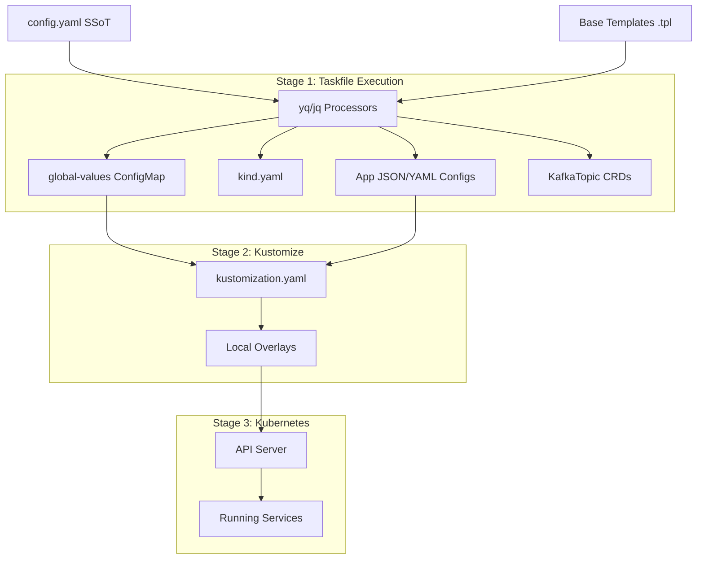

# The SSoT Rendering Pipeline

The defining feature of this local development environment is the **Single Source of Truth (SSoT)** rendering pipeline. We do not maintain hardcoded values across dozens of YAML manifests. Instead, everything stems from `config.yaml`.

This document explains exactly how values flow from `config.yaml` to running Kubernetes Pods.

## Pipeline Architecture

When a developer runs `task up` or `task render`, the Taskfile invokes the rendering pipeline. This pipeline primarily utilizes `yq` (a YAML processor) and `jq` (a JSON processor) to generate configuration files dynamically.



## How It Works: The `global-values` ConfigMap

To pass variables from `config.yaml` into Kubernetes natively (without using Helm), we generate a massive flat ConfigMap called `global-values`.

1. **Flattening:** The `task render:values` command iterates through the nested structure of `config.yaml`.
2. **Key Generation:** It converts paths like `settings.kafka.port` into flat keys like `settings_kafka_port: "9092"`.
3. **Image Tag Generation:** It parses the `images` block and pre-calculates full OCI paths (e.g., `docker.io/library/postgres:17.0-alpine`).
4. **ConfigMap Creation:** These flat keys are written to `k8s/components/overlays/local/values.yaml` as a Kubernetes ConfigMap.

### Using Values in Kustomize

Inside our Kustomize overlays, we use the `global-values` ConfigMap to dynamically patch deployments. Kustomize reads the flat keys and injects them as Environment Variables or configuration parameters.

**Example Patch:**
```yaml
# Kustomize replacement patch
replacements:
  - source:
      kind: ConfigMap
      name: global-values
      fieldPath: data.settings_kafka_jvm_xmx
    targets:
      - select:
          kind: Kafka
          name: kafka-cluster
        fieldPaths:
          - spec.kafka.jvmOptions.-Xmx
```
This is how we enforce JVM auto-sizing and dynamic port assignment without Helm.

## Specialized Generators

Not all configurations can be simple ConfigMap environment variables. The Taskfile features specialized rendering logic for complex apps:

* **`render:kind`**: Merges base `kind-config.base.yaml` with the Node image and Host port mappings defined in `config.yaml`, yielding the final cluster topology.
* **`render:telemetry`**: Injects Prometheus target ports directly into the `prometheus.yml.tpl` using `sed` and `yq`, and automatically mutates downloaded Grafana dashboards to align datasource variable names (e.g., swapping `${DS_PROMETHEUS}` for the hardcoded local instance).
* **`render:topics`**: Iterates over `definitions/topics/*.json`, combining developer-defined topic names, partitions, and custom configs with a base `KafkaTopic` template to generate explicit CRDs.

By keeping the rendering logic inside the `Taskfile`, we ensure the process is transparent, easily debuggable, and completely idempotent.
